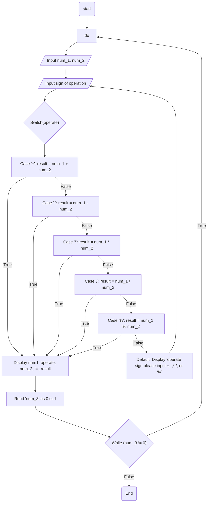

                    Analysis

Input:
The program prompts the user for two numbers and the type of arithmetic operation they want to perform. It also allows the user to calculate the remainder using the '%'  option. The program prompts the user to enter 0 to quit or any other number to continue.

Process:
The program performs basic arithmetic operations based on the user's input, including addition, subtraction, multiplication, division, and remainder calculation. It uses a do-while loop to allow the user to perform multiple calculations.

Output:
The program displays the result of the arithmetic operation and prompts the user to enter 0 to quit or any other number to continue.

                  Algorithm Design (Pseudocode)
1. Display "_____________ CALCULATOR _________________" title
2. Declare variables: num_1, num_2, result, status
3. Repeat the following steps in a do-while loop:
   a. Prompt user for input: "Please enter the first number: "

   b. Read user input and store it in the variable num_1

   c. Prompt user for input: "Please enter the second number: "

   d. Read user input and store it in the variable num_2

   e. Prompt user for input: "Enter the type of operation you want, (+ , - , * , / ) or (%) if you want to calculate remainder: "

   f. Read user input and store it in the variable operate

   g. Use a switch statement to perform the corresponding arithmetic operation based on the value of operate:

      -> Case '+': result = num_1 + num_2;

      -> Case '-': result = num_1 - num_2;

      -> Case '*': result = num_1 * num_2;

      -> Case '/': result = num_1 / num_2;

      -> Case '%': result = static_cast<int>(num_1) % static_cast<int>(num_2);

      -> Default: Display an error message and go to step e (label: loop)
   
   h. Display the arithmetic expression and result: num_1 operate num_2 = result

   i. Prompt user for input: "Please enter 0 to quit or any other number to continue: "

   j. Read user input and store it in the variable status

   k. Continue the loop if status is not equal to 0
4. End program

## Flowchart

