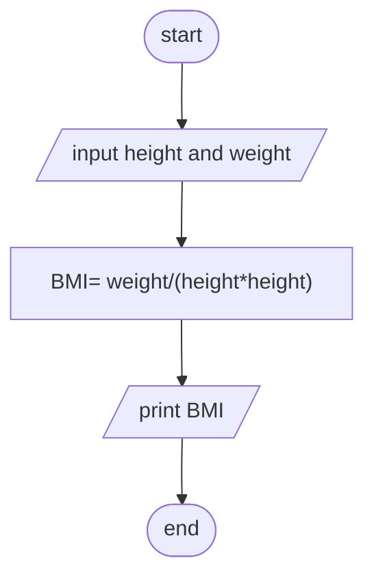

input -> height and weight
opreation -> BMI = weight/(height*height)
optput -> BMI

pseudo code
1. start
2. input height and weight
3. BMI= weight/(height*height)
4. print BMI
5. end

flowchart

```mermaid
    flowchart TD;
    A([start])-->B[/input height and weight/];
    B-->C["BMI= weight/(height*height)"];
    C-->D[/print BMI/];
    D-->E([end]);
```