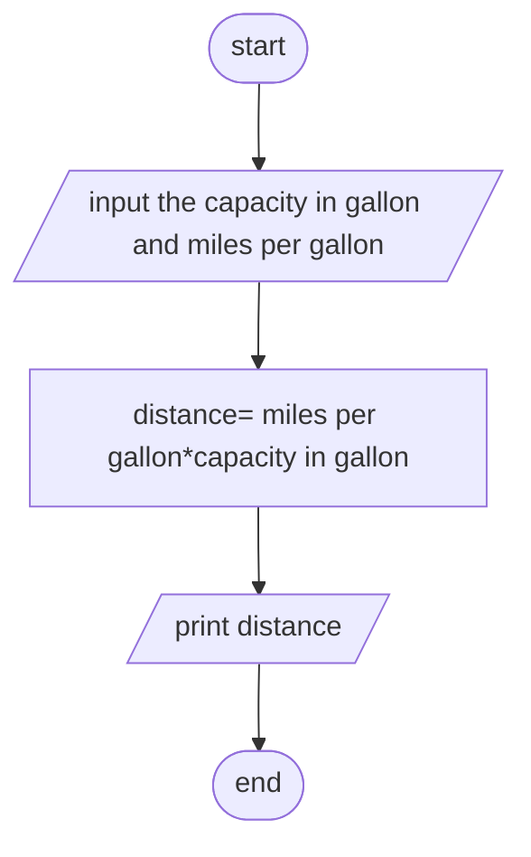

input -> the capacity of the car tank in gallons
      -> the miles per gallons the automobile can be driven

opreation -> the amount of miles the automobilie can be driven = capacity * miles per gallons

output -> the amount of miles the cutomobile can be driven

pseudo code
1. start
2. input the capacity in gallon and miles per gallon
3. distance= miles per gallon*capacity in gallon
4. print distance
5. end

flowchart

