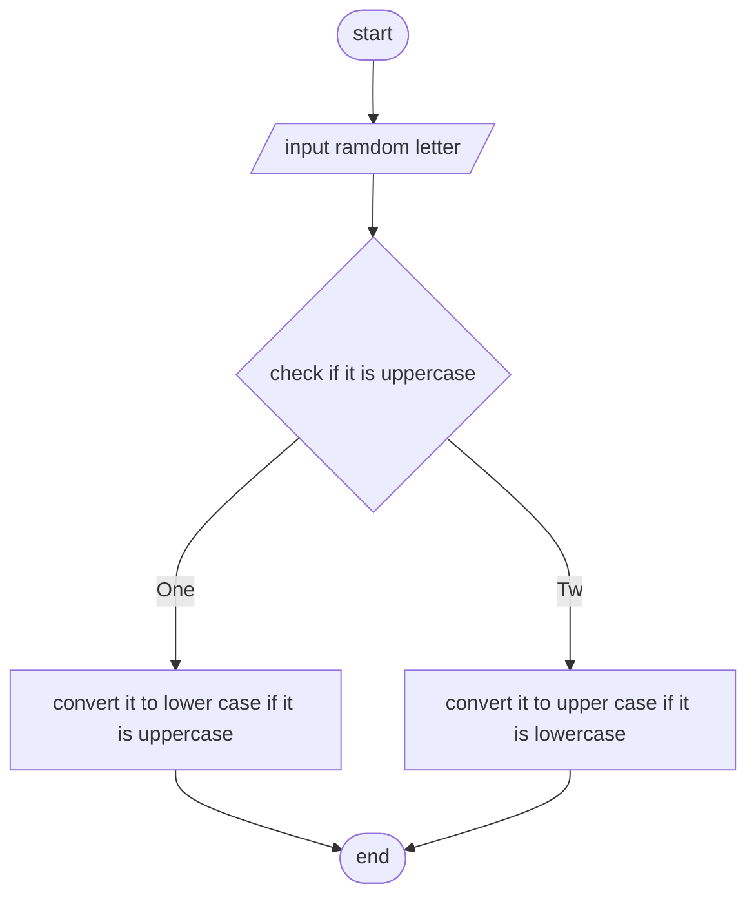

input -> ramdom letter
opreation -> convert it to lower case if it is uppercase
          -> convert it to upper case if it is lowercase

output -> display the final letter

pseudo code
1. start
2. input a letter
3. if the letter is lower change to upper and if it is upper change to lower
4. print the case
5. end

flowchart

