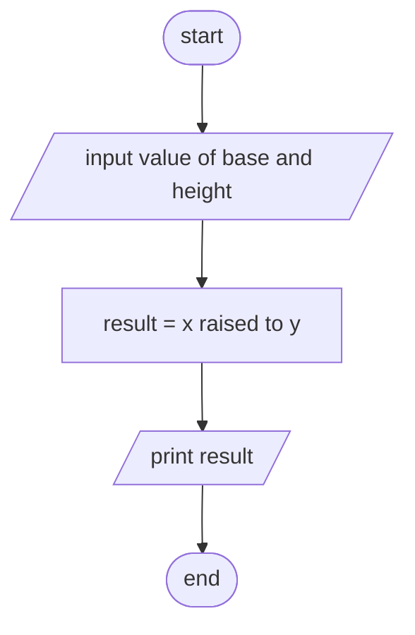

input -> base and power

opreation -> insert it in power function with the base and power

output -> display the final fnction

pseudo code
1. start
2. input value of x and y
3. x raised to y
4. print result
5. end

flowchart
