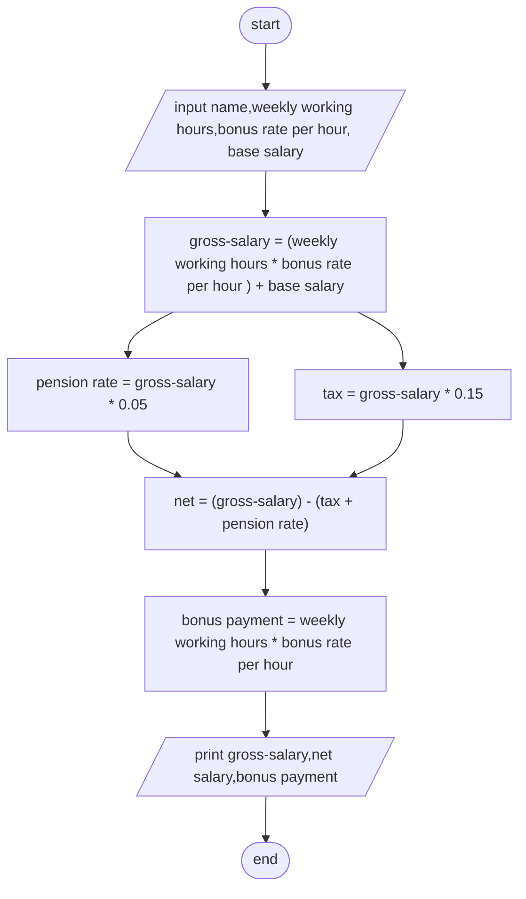

input -> name
      -> weekly working hours 
      -> bonus rate per hour 
      -> base salary

opreation -> gross-salary
                -> (weekly working hours * bonus rate per hour ) + base salary
          -> net salary 
                -> pension rate = gross-salary * 0.05
                -> tax = gross-salary * 0.15
                -> net = (gross-salary) - (tax + pension rate)
          -> bonus payment
                -> weekly working hours * bonus rate per hour

output -> gross-salary
       -> net salary 
       -> bonus payment

psedocode
1. start
2. input name,weekly working hours,bonus rate per hour, base salary
3. gross-salary = (weekly working hours * bonus rate per hour ) + base salary
4. pension rate = gross-salary * 0.05
5. tax = gross-salary * 0.15
6. net = (gross-salary) - (tax + pension rate)
7. bonus payment = weekly working hours * bonus rate per hour
8. print gross-salary,net salary,bonus payment
9. end

flowchart
