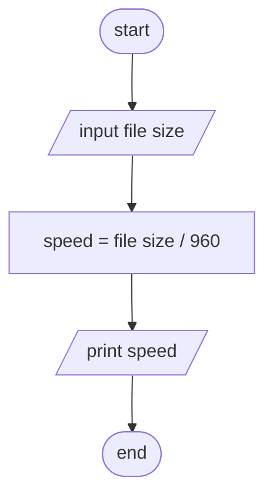

input -> file size

opreation -> file size / 960

output -> total time taken

psedcode
1. start
2. input file size
3. speed =  file size / 960
4. print speed
5. end

flowchart

```mermaid
    flowchart TD;
    A([start])-->B[/input file size/];
    B-->C["speed =  file size / 960"];
    C-->D[/print speed/];
    D-->E([end]);
```